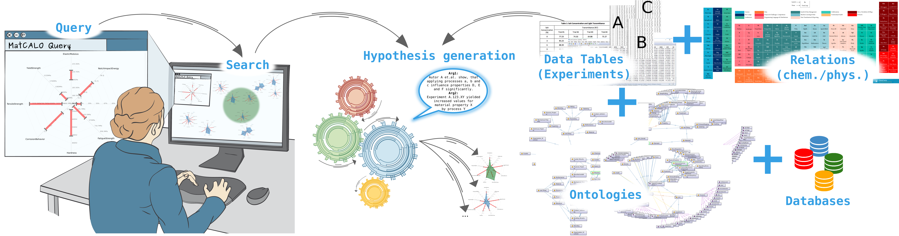

Section Title
=============
The Common Denominator
======================

Subsection Subtitle
-------------------
Titles and Section headers
--------------------------

* item text::

        code block

\*This\* is not *italic* - \\My Pictures\\ is a Windows folder

Mark *italic text* with one asterisk, **bold text** with two.
For ``monospaced text``, use two "backquotes" instead.

****

+-------+----------+------+
| Table Headings   | Here |
+-------+----------+------+
| Sub   | Headings | Too  |
+=======+==========+======+
| cell  | column spanning |
+ spans +----------+------+
| rows  | normal   | cell |
+-------+----------+------+
| multi | * cells can be  |
| line  | * formatted     |
| cells | * paragraphs    |
| too   |                 |
+-------+-----------------+

===== ========= =====
Table Headings  Here
--------------- -----
Sub   Headings  Too
===== ========= =====
column spanning no
--------------- -----
cell  cell      row
column spanning spans
=============== =====

.. ..

 <!--- Need blank line before this line (and the .. line above).
 HTML comment written with 3 dashes so that Pandoc suppresses it.
 Blank lines may appear anywhere in the comment.

 All non-blank lines must be indented at least one space.
 HTML comment close must be followed by a blank line and a line
 that is not indented at all (if necessary that can be a line
 with just two periods followed by another blank line).
 --->

term
  : definition

longer term
  : multi-line definition
  a second line (will be subject to flow and wrapping)

  a second paragraph in the definition

complex term
  : first definition

  : second definition

.. automethod:: matcalo.core.base.MatCALO.infer
.. automethod:: matcalo.core.base.MatCALO.learn

Reference figures:

See :num:`figure #example-fig` on page :page:`example-fig` for the figure labeled :ref:`example-fig`.

.. _example-fig:

    Example figure