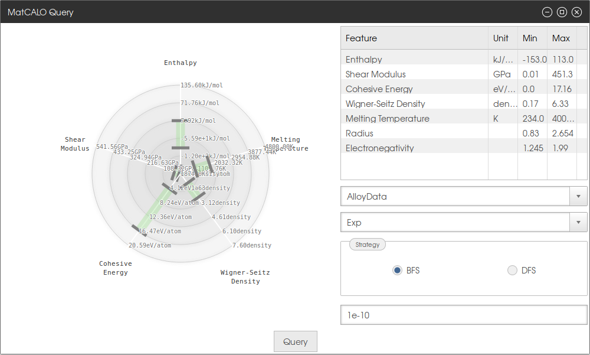
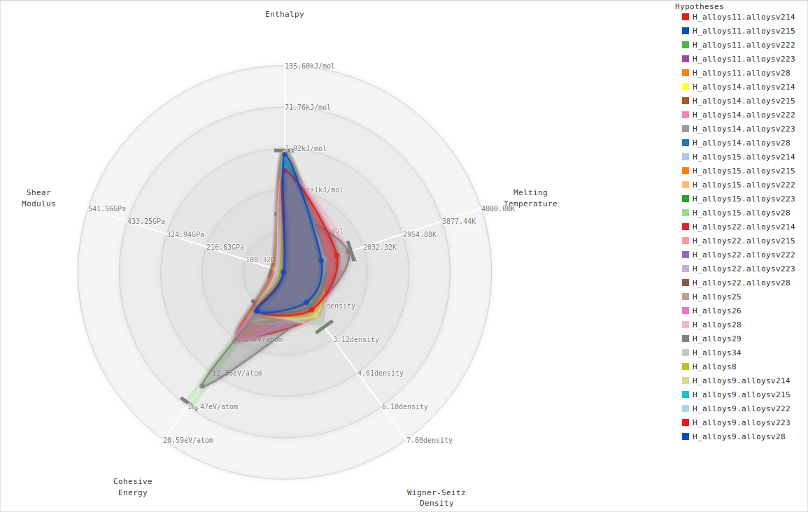
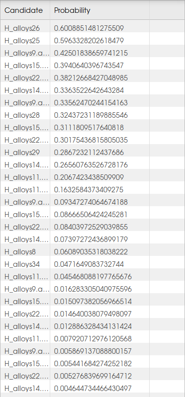
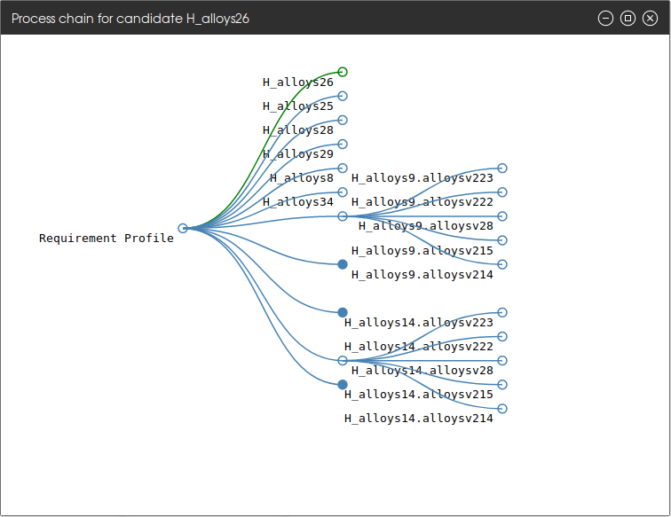

For Users
=========

|project| provides a web interface that allows to

 - execute the |project| inference with an easy-to-use graphical interface (Tab |project|) and
 - interpret the results using representative visualizations
 - use basic analysis tools on their own data (Tab `Data Analysis`)

Reasoning
---------

The |project| reasoning pipeline can be executed by graphically defining a requirement profile for the desired
material to find. Clicking on the button named `Define Requirement Profile` opens a new window
(:num:`Fig. #webif-query`: :ref:`webif-query`) that allows to select
predefined reqirement profiles or create an entirely new one, select a reasoning strategy and set a threshold to limit
the results. In the upper right corner, all possible features that can be subject to search are listed along with their
respective units and possible min/max values.

The first drop-down menu allows to select an item from a predefined set of domains. For each domain, there are multiple
presets defined, which can be selected from the second drop-down menu below. Selecting a preset will update the
radar-chart visualization on the left, i.e. an axis for each feature in the preset will be created. The green bar represents the
interval of values that are defined to be acceptable for this feature. The end points of the bar can be dragged to the
desired positions to change the accepted values for the respective feature.

The `Strategy`-box allows to select an inference strategy for the reasoning pipeline. Available are breadth-first search
(BFS) and depth-first search (DFS). The results will be the same, but depending on the problem, one or the other may
be faster.

The text field below allows to define a threshold, i.e. only hypotheses with a probability higher or equal to this
value will be shown in the results.

A right-click on a feature in the table opens a context-menu that allows to update its values or add/remove this
feature to/from the requirement profile on the left. Adding a feature will create a new axis with the axis limits
being the min/max values of this particular feature.

Clicking the `Query`-button will trigger the reasoning pipeline.

.. _webif-query:

    |project| Query

    The |project| Query window.

The results of the reasoning process will be shown in two ways. The first one is a visualization that adds a colored
area for each candidate result in the previously defined radar chart (see :num:`Fig. #webif-hyps`: :ref:`webif-hyps`).
This allows to visually compare the candidates with respect to their proximity to the requirement profile. The
respective polygons can be highlighted by clicking on their name in the legend.

.. _webif-hyps:

    Hypotheses: Radar Chart

    The visualization of the generated candidates to allow a comparison between the query (green bars) and the results (colored polygons).

The second way to investigate the results is to check the generated candidates in the table on the right
(see :num:`Fig. #webif-table`: :ref:`webif-table`). Here, each candidate is listed along with its respective probability.
This probability denotes how likely the requirement profile is matched given the process pipeline represented by this
candidate was executed with the respective parameters.

.. _webif-table:

    Hypotheses: Table

    The table listing the hypotheses for the query.

This process pipeline and the parameters can be visualized by right-clicking on the candidate and selecting `Show process
history of the candidate`. A new window pops up showing a tree visualization
(see :num:`Fig. #webif-tree`: :ref:`webif-tree`). The selected candidate will be highlighted in green. Each path from
the start node to a leaf represents one process pipeline. Each edge represents one process step.
Hovering over the process name will show a tooltip with the respective parameters for this process. Each node thus
represents the state the material is in after executing the processes on the path from the start node to this node.
The tooltip of the start node shows the requirement profile, the one of the leaf node shows the probability and the
overall result of the process chain.

.. _webif-tree:

    Process Chains

    The resulting suggested process chains for the query.

The hypotheses can also be downloaded as JSON or XLS file, the visualization as SVG file to allow the easy comparison of
results of different queries.

Analysis
--------

Users can upload their own datafiles and perform basic data analysis using |project|. The upload is limited in the
number, size and type of the files. The uploaded data will only be stored temporarily and is deleted once the user's
session expires. The uploaded data is not available for anyone else but the user who uploaded them.

The tools can handle data that is uploaded in a semicolon-separated .csv-file in the following format as exemplified
in :ref:`table-acceptedformat`:

  - | The first row contains the header information. Feature names that start with `target_` will automatically be considered target features.
    | This may not make a difference for some of the analysis tools.
  - | The second row contains information in which unit the respective column is measured, e.g. %, MPa, °C. Leave empty if there is no unit.
  - | Each of the following rows is considered one training example. Values must be numeric, i.e. integers or floats.
    | **Exception 1:** the ``id`` value can be of type string.
    | **Exception 2:** if an enum for the specific column type exist, other values are allowed. Currently known enums: Element (mapping a symbol from the Periodic Table to its atomic number)
  - | Missing values can be identified by inserting a default value that can be replaced later.
  - | **(optional)** If a column named ``id`` exists, its values will serve as identifiers for each training sample, which allows to investigate inference results later and retrieve examples the results base on.
    | If this column does not exists or its values are empty, each sample will automatically be assigned an id in ascending order.

.. _table-acceptedformat:

.. table:: Example: Accepted Table-format

    +---------------+----------------+------+-----------+-----------------+------+---------------------+
    | id            | num_passengers | \... | avg_speed | target_distance | \... | target_fuel_savings |
    +---------------+----------------+------+-----------+-----------------+------+---------------------+
    |               |                | \... | km/h      | km              | \... | %                   |
    +===============+================+======+===========+=================+======+=====================+
    | e\ :sub:`0`\  |       1        | \... |    75     |     400.4       | \... |      0.1234         |
    +---------------+----------------+------+-----------+-----------------+------+---------------------+
    | e\ :sub:`1`\  |       3        | \... |    61     |     1000.3      | \... |       0.98          |
    +---------------+----------------+------+-----------+-----------------+------+---------------------+
    | \...          |      \...      | \... |    \...   |     \...        | \... |       \...          |
    +---------------+----------------+------+-----------+-----------------+------+---------------------+
    | e\ :sub:`t`\  |       4        | \... |    100    |     810.7       | \... |       0.56          |
    +---------------+----------------+------+-----------+-----------------+------+---------------------+

The data analysis section currently comprises the following algorithms:

    - **Clustering**, using the ``sklearn.cluster.DBSCAN`` algorithm (see `sklearn.cluster.DBSCAN <https://scikit-learn.org/stable/modules/generated/sklearn.cluster.DBSCAN.html>`_)
    - **PCA**, using the ``sklearn.decomposition.PCA`` algorithm (see `sklearn.decomposition.PCA <https://scikit-learn.org/stable/modules/generated/sklearn.decomposition.PCA.html>`_)
    - **Regression** Trees, using a modified version of the ``sklearn.tree.DecisionTreeRegressor`` (see :class:`matcalo.core.algorithms.RegressionTree` and `sklearn.tree.DecisionTreeRegressor <https://scikit-learn.org/stable/modules/generated/sklearn.tree.DecisionTreeRegressor.html>`_ for details)

Each of the tools allows to copy the textual results and download the visualization as .svg file.

Clustering
~~~~~~~~~~

.. note::
    This page is under construction

PCA
~~~

.. note::
    This page is under construction

Regression Trees
~~~~~~~~~~~~~~~~

.. note::
    This page is under construction